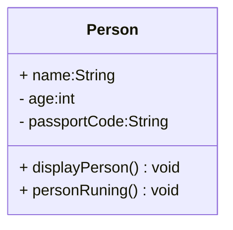

2026-02-05  03:57 pm

Tags: [[School]] [[Coding]] [[Duke]] [[Java]]

---
# Duke's Object Oriented Programming  |  2025-26

---

## Prelim

### 01/22/2026 - Module 1

#### Functions 
- The group of codes or statements that performs one task

#### Types of Functions

- Methods written by the programmer.

#####  a) **Method with No Parameters & No Return Value**

```java
void greet(){     
	System.out.println("Hello!"); 
}
```

#####  b) **Method with Parameters & No Return Value**

``` java
void greetUser(String name) {
	System.out.println("Hello " + name); 
}
```

#####  c) **Method with Return Value & No Parameters**

```java
int getNumber() {
     return 10; 
}
```

##### d) **Method with Parameters & Return Value**

```java

int add(int a, int b) {     
	return a + b; 
}
```


#### Objects 
- Used to represent real-world entities in the program
- Characteristics 
- Actions 
- Properties / Attributes 
- Methods


#### Case Scenario:
- Parking space
- Condominium Car parking system 
- Object: Car  / Attributes: Vehicle type  , Owner's name , OR CR data, Rental fee , Rental type , Parking ticket id, 
- Methods and Action:  park in / park out (requried attribute : Plate number , date , )

#### First Create is Class
- Class - The blueprint of the object .
- Class is define and structor Object .
- Templated Object.


---

### 2026-01-28 - Lab Activity 1


####  Object-Oriented Programming 

Object- Oriented programming  is a programming paradigm that organizes a program in to objects. which represent real-world entities. Each object is create from a class and contains data (attributes)  and behavior(methods). OOP focuses on modeling real-life systems by combining data and operations into a single unit, making programs easier to design , understand , and maintain. 

物件導向程式設計（Object-Oriented Programming, OOP）是一種程式設計範式，主要使用「物件」的概念來組織和簡化程式碼。這種方法強調資料與操作資料的方法（函數）的結合，使得程式更易於理解、維護和擴展。

#### Characteristics of Object Oriented Programming

**Encapsulation:**

	- Bundles data and methods within a class
	- Protects data from unauthorized access by controlling visibility 

**Abstraction:**

	- Shows only essential features while hiding complex implementation details
	- Helps reduce complexity and improves usability.
	- 抽象是指從具體的實例中提取出共通的特徵，以簡化問題的複雜性。在OOP中，這意味著通過定義類別來隱藏不必要的細節，只顯示對使用者需要的信息。例如，在一個「支付系統」中，您可能有一個「支付方式」的抽象類別，其中定義了支付的基本方法，但具體的支付實現（如信用卡、支付寶、PayPal）則隱藏在其各自的類別中。


**Inheritance:**

	- Allows a class to acquire properties and behaviors of another class
	- Promotes code reuse and hierarchical organization.
	- 允許一個類別從另一個類別繼承屬性和方法，提高了程式碼的重用性。


**Polymorphism:**

	- Enables a single method name to perform different behaviors depending on the object. 
	- Improves flexibility and extensibility . 
	- 允許不同類別的物件以相同方式對待，實現方法的多種表現。


**Modularity:**

	- Programs are divided in to independent , manageable objects. 
	- Enhances readability and organization . W
	- 模組化則是指將程式碼分割為多個獨立的模組或組件，每個模組專注於一項特定的功能。這使得程式碼更易於維護和重用。


**Example:**

```java
//abstract class: Animal defines basic features of animals

abstract class Animal{
	//Encapsulation: Private variable to protect state
	private String name;
	
	//constructor 
	public Animal(String name){
		this.name = name;
	}
	
	//abstrac method: each animal's sound
	public abstract void makeSound();
	
	//encapsulation: Getter method to access name
	public String getName(){
		return name;
	}
}

//inheritance: dog class inherits from animal
class Dog extends Animal {
	public Dog(String name){
		super(name); //call parent class constructor 
	}
	
	//implement abstract method
	
	@Override
	public void makeSound() {
		System.out.println(getName() + "says woof!");
	}
}

//inheritance: cat class inherits from animal
class Cat extends Animal{
	public Cat(String name){
		super(name); //call parent class constructor
	}
	//implement abstract method
	
	@Override
	public void makeSound(){
		System.out.println(getName() + "says Meow!~");
	}
}

//main class: AnimalTest for testing the program 
public class AnimalTest{
	public static void main(String[] args){
		//polmorphism: using parent type to reference child objects 
		Animal dog_1 = new Dog("Buddy");
		Animal cat_1 = new Cat("Whiskers");
		
		//call method (message)
		
		dog_1.makeSound();
		cat_1.makeSound();
	
	}
}

```


#### Advantages of OOP over Procedural Programming 

| **Aspec**              | **Procedural Programming**           | **Object-Oriented Programming**        |
| ---------------------- | ------------------------------------ | -------------------------------------- |
| 1. Program Structure   | Based on functions as and procedures | Based on objects and classes           |
| 2. Data Handling       | Data is often global and exposed     | Data is encapsulated and protected     |
| 3. Reusability         | Limited reuse                        | High reuse through inheritance         |
| 4. Scalability         | Difficult for large systems          | Suitable for large and complex systems |
| 5. Maintenance         | Harder to update and debug           | Easier to maintain and extend          |
| 6. Real-world Modeling | Less intuitive                       | Closely models real-world systems.     |
|                        |                                      |                                        |


#### Benefits of OOP in Program Design 
1. Improved program organization 
	- through modular class structures 
2. Easier maintenance and debugging
	- due to well-defined responsibilities
3. Code reusability
	 - reducing development time and effort 
4. Scalability 
	- making it easier to add new features
5. Better collaboration
	- among developers working on large systems
6. Clear visual representation
	- using UML class diagrams during system planning

#### What is an Class 
A class is a blueprint or template used in Object-Oriented Programming(OOP) to define the properties(attributes) and behaviors (methods) that objects will have . 

It does not represent a real object by itself, but is describes what an object is and what it can do .

In simple terms, a class defines:
- What data an object holds.(attributes)
- What actions an object can perform(methods)

**Example**:
```java
//public class
public class Student{
	//class attributes 
	String name;
	int age;
	int studentID;
	
	//constructor to initialize a new student object 
	public Stdudent(String name,int age, int studentID){
		this.name = name;
		this.age = age;
		this.studentID = studentID;
	}
	
	//method to display the student's information 
	public void displayInfo(){
		System.out.println("Student Information: ");
		System.out.println("Name: " + name);
		System.out.println("Name: " + age);
		System.out.println("Name: " + studentID);
	}
}

public class Main{
	public static void main (String[] args){
	
		//create a first student object 
		Student student_1 = new Student("Duke HSu", 20, 1001);
		Student student_2 = new Student("Six", 21, 1002);
		
		//call student class method - displayInfo()
		System.out.println("Student 1 Details: ");
		student_1.displayInfo(); //message = object + method
		
		System.out.println("Student 2 Details: ");
		student_2.displayInfo(); 
	}
}
```

#### What is an Object ?

An object is a real , usable entity created from  a class. It represents something that exists in a program and has its own data(attributes)  ab behavior (methods)

#### Class and Instance Data Values(Attributes)

Class and Instance Data Values(attributes)
- Attributes are variables that store data about an object , they represent the state of an object .
- Example: class **`Student`**  has attribute **`studentID`**

**Code Example:**

```java

// Car class define the structure of a car
class Car{
	//instance data value: color and model as public
	public String color;
	public String model;
	
	//constructor to initialize the instance data values
	public Car(String color, String model){
		this.color = color;
		this.model = model;
	}
	
	//method to display car detiles 
	public void displayDetails(){
		System.out.println("Car model: " + model);
		System.out.println("Car color: " + color);
		
	}
}


public class CarTest {
	public static void main(String[] args){
		//create different car object(instances)
		Car car1 = new Car("Red","Toyota");
		Car car2 = new Car("Blue", "Honda");
		
		
		//call method
		car1.displayDetails(); //red toyota
		car2.displayDetails(); //blue honda
		
		//change colors directly since they are public
		car1.color = "Black";
		car2.color = "White";
		
		//display update detailes
		car1.displayDetails();
		car2.displayDetails();
	
		
	
	
	}

}


```


#### UML Class Diagram 

UML = Unified Modeling Language 
A UML class diagram is a visual representation of classes in an object-oriented system. It shows:
- Classes
- Attributes
- Methods
- Relationships between classes 



Structure of a UML  Class Diagram 
A class is drawn as a rectangle with three sections:

| Class Name |
| ---------- |
| Atrributes |
| Methods    |
**Visibility of Attributes and Methods in the Class**

| symbol | means           | example               | explain                         | for                                                             |
| ------ | --------------- | --------------------- | ------------------------------- | --------------------------------------------------------------- |
| +      | public          | + name:String         | public attributes or methods    | any class can be accessed                                       |
| -      | private         | - passportCode:String | private attributes or methods   | can't  be accessed by any other class or subclass               |
| #      | protected       | # phone_num:String    | protected attributes or methods | can only be accessed by the same class or its subclasses        |
| ~      | package/default | ~eat()                |                                 | can be used by any other class as long it's in the same package |
|        |                 |                       |                                 |                                                                 |

**Parameter Directionality**

| direction | means                                          | example                          | explain |
| --------- | ---------------------------------------------- | -------------------------------- | ------- |
| in        | need get parameters form user or other class   | + method(in p1: String):void     |         |
| inout     | parameters and return values from self         | + method(inout p1:String):String |         |
| out       | no need parameters but return values from self | # method(out p1: String):String  |         |


#### References: 

Module 1 - Introduction to Object Oriented Programming PPT 
UML class diagrams - https://www.youtube.com/watch?v=6XrL5jXmTwM
UML Class Diagram Tutorial - https://www.lucidchart.com/pages/uml-class-diagram
Online shopping cart UML class diagram example - https://lucid.co/templates/online-shopping-cart-uml-class-diagram-example


---

